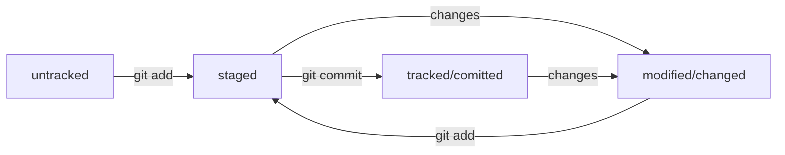

# Консоль и GitHub: открой дверь в мир разработки

Проект представляет собой шпаргалку по базовым командам в консоли и работе с GitHub. В нем описаны основные команды для навигации, работы с файлами и папками, полезные возможности и руководство по работе с GitHub. Этот проект будет полезен для тех, кто хочет научиться эффективно использовать командную строку и освоить основы работы с GitHub.

# Содержание
- [**Шпаргалка. Базовые команды в консоли**](#шпаргалка-базовые-команды-в-консоли)
  - [Навигация](#навигация)
  - [Работа с файлами и папками](#работа-с-файлами-и-папками)
    - [Создание](#создание)
    - [Копирование и перемещение](#копирование-и-перемещение)
    - [Чтение](#чтение)
    - [Удаление](#удаление)
  - [Полезные возможности](#полезные-возможности)
- [**Начало работы с Git**]()
  - [Работа с GitHub](#работа-с-github)
    - [Инициализация репозитория](#инициализация-репозитория)
    - [Добавление файлов в репозиторий](#добавление-файлов-в-репозиторий)
  - [Cинхронизация репозиториев]()
    - [Просмотр истории коммитов](#просмотр-истории-коммитов)
    - [Генерация SSH-ключа и его привязка к GitHub](#генерация-ssh-ключа-и-его-привязка-к-github)
    - [Связывание локального и удаленного репозиториев](#связывание-локального-и-удаленного-репозиториев)
  - [Навигация по коммитам. Статусы файлов](#навигация-по-коммитам-статусы-файлов)
    - [Хеш — идентификатор коммита](#хеш--идентификатор-коммита)
    - [Исследуем лог](#исследуем-лог)
    - [HEAD — последний из коммитов](#head--последний-из-коммитов)
    - [Статусы файлов в Git](#статусы-файлов-в-git)
    - [Как читать статусы Git](#как-читать-статусы-git)
  - [Работа над ошибками в коммитах](#работа-над-ошибками-в-коммитах)
    - [Оформление сообщений к коммитам](#оформление-сообщений-к-коммитам)
    - [Исправление коммита](#исправление-коммита)
    - [«Откат» файлов и коммитов](#откат-файлов-и-коммитов)
  - [Просмотр изменений. Игнорирование файлов](#просмотр-изменений-игнорирование-файлов)
    - [Просмотр изменений файлов и сопоставление коммитов](#просмотр-изменений-файлов-и-сопоставление-коммитов)
    - [Игнорирование файлов в Git](#игнорирование-файлов-в-git)


# Шпаргалка. Базовые команды в консоли

## Навигация
-  `pwd` (от англ. _**p**rint **w**orking **d**irectory_, «показать рабочую папку») – показывает рабочую папку;
-  `pwd -L` (от англ. _**p**rint **w**orking **d**irectory_, «показать абсолютный путь текущей папки») – показывает абсолютный путь текущей папки. Эта команда полезна, когда нужно узнать полный путь к текущей рабочей папке.
-  `ls` (от англ. _**l**i**s**t directory contents_, «отобразить содержимое директории») – отображает содержимое директории;
-  `ls -a` – отображает также скрытые файлы и папки, названия которых начинаются с символа;
-  `ls -l` – отображает подробную информацию о файлах и папках в текущей папке. Эта команда поможет вам получить больше информации о содержимом текущей папки, включая размер файлов, права доступа и дату их создания.
-  `cd first-project` (от англ. _**c**hange **d**irectory_, «сменить директорию») – перейдет в папку `first-project`;
-  `cd first-project/html` – перейдет в папку `html`, которая находится в папке `first-project`;
-  `cd ..` – перейдет на уровень выше, в родительскую папку;
-  `cd ~` – перейдет в домашнюю директорию (`/Users/Username`);
-  `cd /` – перейдет в корневую директорию.

## Работа с файлами и папками

### Создание
-  `touch index.html` (англ. *touch*, «коснуться») — создаёт файл `index.html` в текущей папке;
-  `touch index.html style.css script.js` — если нужно создать сразу несколько файлов, можно напечатать их имена в одну строку через пробел;
-  `mkdir second-project` (от англ. _**m**a**k**e **dir**ectory_, «создать директорию») — создаёт папку с именем `second-project` в текущей папке.

### Копирование и перемещение
-  `cp file.txt ~/my-dir` (от англ. _**c**o**p**y_, «копировать») — скопирует файл в другое место;
-  `mv file.txt ~/my-dir` (от англ. _**m**o**v**e_, «переместить») — переместит файл или папку в другое место.

### Чтение
-  `cat file.txt` (от англ. _**c**onc**at**enate and print_, «объединить и распечатать») — распечатает содержимое текстового файла file.txt.

### Удаление
-  `rm about.html` (от англ. _**r**e**m**ove_, «удалить») — удалит файл `about.htm`l;
-  `rmdir images` (от англ. _**r**e**m**ove **dir**ectory_, «удалить директорию») — удалит папку `images`;
-  `rm -r second-project` (от англ. _**r**e**m**ove_, «удалить» + _**r**ecursive_, «рекурсивный») — удали папку `second-project` и всё, что она содержит.

## Полезные возможности
- Команды необязательно печатать и выполнять по очереди. Можно указать их списком — разделить двумя амперсандами (`&&`).
- У консоли есть собственная память — буфер с несколькими последними командами. По ним можно перемещаться с помощью клавиш со стрелками вверх (`↑`) и вниз (`↓`).
- Чтобы не вводить название файла или папки полностью, можно набрать первые символы имени и дважды нажать `Tab`. Если файл или папка есть в текущей директории, командная строка допишет путь сама. Например, вы находитесь в папке `dev`. Начните вводить `cd first` и дважды нажмите `Tab`. Если папка `first-project` есть внутри `dev`, командная строка автоматически подставит её имя. Останется только нажать `Enter`.

# Начало работы с Git

## Работа с GitHub

### Инициализация репозитория
- Создание Git-репозитория в папке с файлами проекта: `git init`
- Проверка состояния репозитория: `git status`

### Добавление файлов в репозиторий
- Подготовка файлов для сохранения в репозитории: `git add`
- Сохранение изменений файлов в коммите: `git commit`
- Добавление всех файлов в репозиторий: `git add .` или `git add --all`
- Создание коммита с описанием:
```
git commit -m "Добавлен новый файл"
```

**Дополнительно**
-  `git commit --amend --no-edit` (от англ. *amend*, «исправить») — добавляет изменения к последнему коммиту и оставляет сообщение прежним;

- `git commit --amend -m "Новое сообщение"` — изменяет сообщение к последнему коммиту на Новое сообщение;

- 💡 Выйти из редактора Vim можно по нажатию `Esc`, затем необходимо ввести `:qa!` и подтвердить на `Enter`.

## Cинхронизация репозиториев

### Генерация SSH-ключа и его привязка к GitHub
SSH (Secure Shell) - сетевой протокол для безопасного обмена данными между компьютерами. Для доступа к репозиторию на GitHub необходимо создать SSH-ключ, который подтверждает вашу личность и права на чтение/изменение данных.

Создание SSH-ключа:
1. Введите команду `ssh-keygen -t ed25519 -C "адрес_электронной_почты_аккаунта_на_GitHub"` в терминале.
2. Скопируйте содержимое публичного ключа (файл с расширением `.pub`).
Привязка SSH-ключа к GitHub:
1. Перейдите в настройки аккаунта на GitHub и добавьте публичный ключ.
2. Проверьте подключение с помощью команды `ssh -T git@github.com`.
3. Проверьте подлинность ключей GitHub перед первым подключением по [ссылке](https://docs.github.com/en/authentication/keeping-your-account-and-data-secure/githubs-ssh-key-fingerprints).
4. Добавить приватный SSH-ключ в ssh-агент командой
```bash
eval  "$(ssh-agent  -s)" &&
ssh-add  ~/.ssh/id_ed25519
```

Важно помнить, что приватный ключ никогда не должен быть передан другим людям или использован для доступа к вашему аккаунту. Это может привести к несанкционированному доступу к вашим данным на GitHub.

### Связывание локального и удаленного репозиториев
- Привязка удаленного репозитория к локальному: `git remote add`
- Связывание с удаленным репозиторием с указанием имени:
`git remote add origin git@github.com:%ИМЯ_АККАУНТА%/first-project.git `
- Использование команды`git remote -v`, для проверки, что локальный и удаленный репозитории связаны
- Отправка изменений в удаленный репозиторий: `git push`

Эта команда позволяет вам отправить ваши локальные изменения в удаленный репозиторий `Git`. После выполнения этой команды, ваши коммиты и изменения будут доступны для других разработчиков через удаленный репозиторий.

## Навигация по коммитам. Статусы файлов

### Хеш — идентификатор коммита
**Хеш** — идентификатор коммита в `Git`. Хеширование - преобразование набора данных для получения их "отпечатка". Хеш коммита получается с помощью алгоритма `SHA-1`, он состоит из цифр 0-9 и латинских букв A-F. 

#### Свойства хеша:
- Если дважды получить хеш для одного набора данных, результат будет одинаковым.
- Если изменить хоть что-то в исходных данных, хеш изменится.
- Хеш является основным идентификатором коммита и содержит информацию о его авторе, дате и содержимом закоммиченных файлов. `Git` сохраняет эту информацию в служебных файлах в папке `.git`.

### Исследуем лог
- Лог содержит описание коммита: хеш, автор, дата, сообщение.
- Сокращенный лог помогает быстро найти нужный коммит среди множества.
- Команда `git log --oneline` выводит сокращенный лог с хешами и комментариями.
- Уникальная длина сокращенных хешей помогает идентифицировать коммит.

### HEAD — последний из коммитов
#### Что такое файл `HEAD`?

Файл `HEAD` - это служебный файл в папке `.git` вашего репозитория. Он указывает на самый свежий коммит, то есть на тот, который был добавлен последним.

#### Зачем нужен файл `HEAD`?

Указатель `HEAD` используется довольно часто при работе с Git. Например, многие команды Git принимают в качестве параметра хеш коммита. Если вы хотите передать последний коммит, вместо его хеша можно просто написать слово `HEAD`. Git поймет, что вы имели в виду последний коммит.

Итак, `HEAD` - это не команда, а файл, который указывает на последний коммит. Он помогает упростить работу с системой контроля версий и делает её более удобной для пользователей.

### **Статусы файлов в Git**

В Git файлы могут находиться в разных состояниях, которые определяют, как Git отслеживает изменения в них:
- `untracked`: Файл с этим статусом не отслеживается Git. Это означает, что Git "видит" существование файла, но не следит за его изменениями.
- `staged`: После выполнения команды `git add`, файл попадает в список файлов для коммита. В этом состоянии файл будет включен в следующий коммит.
- `modified`: Этот статус означает, что содержимое файла было изменено относительно последней сохраненной версии.
- `tracked`: Состояние, в котором Git отслеживает изменения в файле. Это может быть файл, который уже был зафиксирован с помощью `git commit`, или файл, добавленный в список с помощью `git add`.

#### Типичный жизненный цикл файла в Git:

1. **Создан:** файл не отслеживается Git, статус `untracked`.
2. **Добавлен в staging area:** после git add, файл в статусе `staged` и `tracked`.
3. **Закоммичен:** после коммита, файл в статусе `tracked`.
4. **Изменен:** после изменений, файл в статусе `modified` и `tracked`.
5. **Снова добавлен в staging area:** после повторного git add, файл снова в статусе `staged` и `tracked`.
6. **Новый коммит:** и так далее.

### Как читать статусы Git

#### Какие состояния показывает `git status`
Большинство файлов в типичном проекте будут находиться в состоянии `tracked` (то есть закоммичены и не изменены после коммита). Вы не увидите это состояние в выводе команды `git status` — иначе она бы каждый раз выводила список вообще всех файлов проекта.

В итоге `git status` показывает только следующие состояния файлов:
- `staged` (`Changes to be committed` в выводе `git status`);

- `modified` (`Changes not staged for commit`);

- `untracked` (`Untracked files`).

#### Типичные варианты вывода `git status`
- **Нет ни `staged`, ни `modified`, ни `untracked` файлов.**
Если ничего не менять в `git-repository` после первого коммита, то в нём не должно быть ни изменённых файлов (`modified`), ни новых (`untracked`), ни добавленных в список на коммит (`staged`).
- **Найдены неотслеживаемые файлы.**
Если есть новые файлы в состоянии `untracked`, они отображаются в секции `Untracked files`. Для добавления их в список на коммит используйте команду `git add`.
- **Найдены изменения, которые не войдут в коммит.**
Если есть изменения в файлах, которые ещё не добавлены в staging area, они отображаются в секции `Changes not staged for commit`. Чтобы подготовить эти изменения к коммиту, используйте команду `git add`.
- **Файл добавлен в staging area, но после этого изменён.**
Если файл был добавлен в staging area, но затем был изменён, он будет отображаться как `Changes to be committed` и `Changes not staged for commit`. Чтобы закоммитить самую свежую версию файла, снова выполните команду `git add` перед коммитом.

## Работа над ошибками в коммитах

### Оформление сообщений к коммитам
Оформление сообщений к коммитам в Git может подчиняться определённым правилам, которые могут быть продиктованы культурой команды или техническими ограничениями. Ниже представлены некоторые основные аспекты оформления сообщений коммитов:

1. Ограничение длины сообщения: Вывод команды git log --oneline умещается в 72 символа, поэтому многие правила включают ограничение длины сообщения до 72 символов.

2. Единообразие формата: Для обеспечения единообразия коммитов, существуют различные подходы к форматированию сообщений. Некоторые из них включают указание типа коммита и текста сообщения, например: `<type>: <message>`.

3. Корпоративный стиль: В некоторых организациях применяется корпоративный стиль, где сообщения коммитов начинаются с Jira-ID, за которым следует текст сообщения.

4. Язык сообщений: Для сообщений на русском языке часто рекомендуется использовать инфинитивы, а для сообщений на английском - повелительное наклонение.

Примеры:

- chore: Обновить зависимости проекта;

- feat: Добавить новую функциональность;

- docs: Update readme file;

- PROJ-456: Исправить ошибку в коде.

Соблюдение правил оформления сообщений к коммитам в Git является важным аспектом для эффективной работы в команде разработчиков.

### Исправление коммита

- `--amend` рассчитан на работу с последним коммитом (`HEAD`);

- Дополнить коммит новыми файлами можно с помощью `git commit --amend --no-edit`. Благодаря опции `--no-edit` сообщение к коммиту останется таким, каким и было;

- Изменить сообщение к коммиту позволяет команда `git commit --amend -m "Обновлённое сообщение коммита"`.

### «Откат» файлов и коммитов
- `git restore --staged hello.txt` (от англ. *restore*, «восстановить») — переведит файл hello.txt из состояния staged обратно в untracked или modified;

- `git restore hello.txt` — возвращает файл hello.txt к последней версии, которая была сохранена через git commit или git add;

- `git reset --hard b576d89` (от англ. `reset`, «сброс», «обнуление» + `hard`, «суровый») — удаляет все незакоммиченные изменения из staging и «рабочей зоны» вплоть до указанного коммита.

## Просмотр изменений. Игнорирование файлов

### Просмотр изменений файлов и сопоставление коммитов
- `git diff` (от англ. _**diff**erence_, «отличие», «разница») — показывает изменения в «рабочей зоне», то есть в modified-файлах;

- `git diff a9928ab 11bada1` — выводит разницу между двумя коммитами;

- `git diff --staged` — показывает изменения, которые добавлены в staged-файлах.

### Игнорирование файлов в Git

Git использует файл `.gitignore` для игнорирования файлов, не требующих отслеживания изменений. Этот файл добавляется в корень репозитория и коммитится вместе с другими файлами. В `.gitignore` указываются файлы или шаблоны файлов, которые Git должен игнорировать.

Символы в `.gitignore`:

- `#` для комментариев

- `*` соответствует любой строке, но не распространяется на вложенные директории

- `**` также соответствует любой строке, а также любому количеству вложенных директорий

- `?` соответствует одному любому символу

- `[...]` соответствуют одному символу из списка в скобках. Например, `file[0-2].txt` исключит из отслеживания файлы `file0.txt`, `file1.txt` и `file2.txt`

- `/` указывает на каталоги. Если шаблон начинается со слеша, то Git игнорирует файлы только в корневой директории

- `!` используется для инвертирования правила, т.е. файлы, которые соответствуют этому шаблону, будут отслеживаться, даже если они соответствуют другому шаблону, который их игнорирует.

Для просмотра игнорируемых файлов используется команда `git status --ignored`. Эта команда выводит список игнорируемых файлов в разделе `Ignored files`.

# Основы работы с ветками в Git

### Клонирование чужого репозитория

`git clone git@github.com:YandexPraktikum/first-project.git` (от англ. *clone*, «клон», «копия») — склонируй репозиторий с URL `first-project.git` из аккаунта `YandexPraktikum` на мой локальный компьютер.

### Создание веток

`git branch feature/the-finest-branch` (от англ. *branch*, «ветка») — создай ветку от текущей с названием `feature/the-finest-branch`;

`git checkout -b feature/the-finest-branch` — создай ветку `feature/the-finest-branch` и сразу переключись на неё.

### Навигация по веткам

`git branch` (от англ. *branch*, «ветка») — покажи, какие есть ветки в репозитории и в какой из них я нахожусь (текущая ветка будет отмечена символом `*`);

`git branch -a` — покажи все известные ветки, как локальные (в локальном репозитории), так и удалённые (в `origin`, или на GitHub).

`git checkout feature/br` — переключись на ветку `feature/br`.

### Сравнение веток

`git diff main HEAD` (от англ. ***diff**erence*, «отличие», «разница») — покажи разницу между веткой `main` и указателем на `HEAD`;

`git diff HEAD~2 HEAD` — покажи разницу между тем коммитом, который был два коммита назад, и текущим.

### Удаление веток

`git branch -d br-name` — удали ветку `br-name`, но только если она является частью `main`;

`git branch -D br-name` — удали ветку `br-name`, даже если она не объединена с `main`.

### Слияние веток

`git merge main` (от англ. *merge*, «сливать», «поглощать») — объедини ветку `main` с текущей активной веткой.

### Работа с удалённым репозиторием

`git push -u origin my-branch` (от англ. *push*, «толкнуть», «протолкнуть») — отправь новую ветку `my-branch` в удалённый репозиторий и свяжи локальную ветку с удалённой, чтобы при дополнительных коммитах можно было писать просто `git push` без `-u`;

`git push my-branch` — отправь дополнительные изменения в ветку `my-branch`, которая уже существует в удалённом репозитории;

`git pull` (от англ. *pull*, «вытянуть») — подтяни изменения текущей ветки из удалённого репозитория.